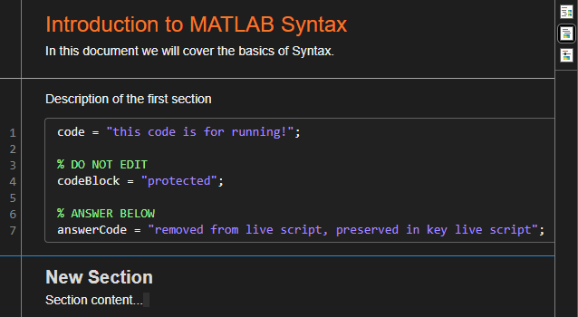

# MATLAB Resources

This repo contains training and reference documentation for how we use MATLAB in the Sampath Lab.

## Installation

Get the latest zip archive file from the releases page. Unzip the file contents to an 
unprivaleged local directory. Navigate the MATLAB current folder to the unzipped 
directory and open the desired live script or open the `CONTENTS.mlx` for an overview 
of the files. Each live script will have the student form and an associated `_key` form. 

Alternatively, clone this repo and run `BUILD` from the MATLAB command window. The
zip file will be created in the `releases` subdirectory. Unzip the archive as 
described above.

## Development

I have implemented a customized m-script parser to allow for protecting and hiding 
code blocks during build. Look at the [examples directory](./examples/) for how to use 
the syntax.

The m-files in the root directory are the main editable and trackable documents. Once
an edit or new creation is made, the whole package can be built with the `BUILD`
command at the MATLAB command window. When naming new files, use the pattern: 

```
type_numericalIndex_Name.m
```
Type will be used for grouping sections of files together. Setting type to `Intro` 
will cause the file to be grouped at the top of the document. All other categories 
will be placed below and in an alphabetical order. 

The numerical index
indicates which position in the ordering for that group the file should occupy. A 
numerical index of 0 will put the file name at the top and all higher numbers will be
placed lower, in order. Try to avoid double numbering within a group, but numbering
should be restarted for each group. 

The `Name` is used for the text of the hyperlink generated in the CONTENTS.mlx file.

When creating a new file, the description in the first header block will be used in
CONTENTS.mlx to generate an overview of the purpose of the file. Therefore it is
best practice to keep this portion of the documentation concise. For example,

```matlab
%% Introduction to MATLAB Syntax
% In this document we will cover the basics of Syntax.
% 
%%%
% Description of first section.

code = "this code is for running!";

%! <- use this syntax to protect a block
codeBlock = "protected";

%@ <- use this syntax to mark code block for answers
answerCode = "removed from live script, preserved in key live script";

%% New Section
% Section content...
```

The above section builds to the following:
</img>  

A key is also built with the answer code shown:
</img>


Upon the first build, a subdirectory named
`_pkg` will be created to hold the generated live scripts. Future runs of `BUILD`
will overwrite these files. Input arguments to the `BUILD` command can override the 
default behavior. Supply any number of existing `filename.m` files (they must be 
located in the root directory) to `BUILD('file1.m','file2.m'[,...'fileN.m'])` and 
the parser will only convert those supplied.

`BUILD` has the following name-value options:
Name | Type | Default| Purpose
:---:|:----:|:------:|:-------
`verbose` | `logical` | `false` | Report exceptions on the command window
`package` | `logical` | `false` | Package built live scripts into zip archive
`buildContents` | `logical` | `false` | Build the contents live script: forced `true` if `package == true`
`executeKey` | `logical` | `false` | Runs all code and saves output on key file

For example, the following statement will parse the `Intro_Syntax.m` document and 
execute all the code cells in the `Intro_Syntax.mlx` file created. Setting the 
`package` option to false will prevent a zip-archive from being created. 

```matlab
BUILD('Intro_Syntax.m',executeKey=false,package=false);
```
